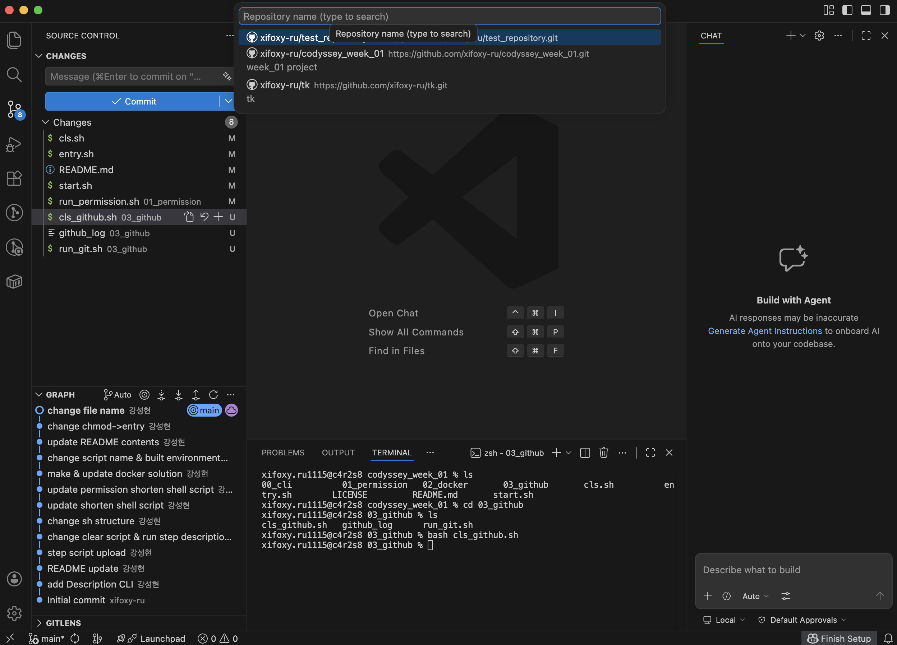

# 개발 워크스테이션 구축 미션

> 이 문서는 `$BASE_DIRECTORY` 디렉토리에서 작업한 내용을 기준으로 작성되었습니다.  
> 현재 문서는 **터미널 기본 조작**, **파일 권한 실습**, 그리고 **Docker 기본 점검/운영/커스텀 이미지/포트 매핑/바인드 마운트/볼륨 영속성**까지 이어서 정리할 수 있도록 작성되었습니다.

---

## 1. 프로젝트 개요

이 과제의 목표는 터미널, Docker, Git/GitHub를 활용하여 재현 가능한 개발 워크스테이션 환경을 직접 구축하고, 그 과정과 결과를 기술 문서로 정리하는 것입니다.

이번 미션에서는 다음 흐름을 중심으로 작업을 진행합니다.

- 터미널로 작업 디렉토리 및 파일을 다루는 기본 조작 수행
- 파일과 디렉토리의 권한 확인 및 변경 실습
- Docker 설치 및 데몬 동작 여부 점검
- hello-world 및 ubuntu 컨테이너 실행과 기본 운영 명령 확인
- Dockerfile 기반 커스텀 이미지 제작
- 포트 매핑을 통한 브라우저 접속 확인
- 바인드 마운트로 호스트 변경 사항이 컨테이너에 즉시 반영되는지 검증
- Docker 볼륨을 이용한 데이터 영속성 확인

---

## 2. 실행 환경

아래 정보는 실제 실행 후 결과에 맞게 업데이트한다.

- OS: macOS
- Shell: bash 또는 zsh
- Terminal: iTerm2 또는 macOS Terminal
- Docker: 실제 실행 후 버전 기입
- Git: 실제 실행 후 버전 기입

버전 확인 명령:

```bash
sw_vers -productVersion
echo "$(basename "${SHELL:-unknown}")"
docker --version
git --version
```

실행 결과 기록 예시:

```bash
os: mac 15.7.4
shell: zsh
docker: 28.5.2
git: 2.53.0
```

> `entry.sh` 는 실행 시작 시 OS, shell, Docker, Git 버전을 출력한 뒤 하위 스크립트들의 실행 권한을 부여하고 `start.sh` 를 호출한다.

---

## 3. 수행 체크리스트

> 아래 체크리스트는 실제 실행과 로그 확보 후 최종 제출 직전에 다시 점검한다.

- [x] 터미널 기본 조작 및 폴더 구성
- [x] 파일 권한 실습
- [x] Docker 설치 및 기본 점검
- [x] hello-world 실행
- [x] ubuntu 컨테이너 실행 및 내부 명령 확인
- [x] Docker 기본 운영 명령 확인
- [x] Dockerfile 기반 커스텀 이미지 제작
- [x] 포트 매핑 검증
- [x] 바인드 마운트 검증
- [x] 볼륨 영속성 검증
- [ ] Git 설정
- [ ] GitHub / VSCode 연동
- [ ] 트러블슈팅 2건 이상 정리

---

## 4. 1단계: 터미널 기본 조작

### 4-1. 실행 구조

이 프로젝트의 상위 실행 진입점은 `entry.sh` 이다.

실행 방법:

```bash
chmod +x entry.sh start.sh
./entry.sh
```

실행 흐름:

1. `entry.sh`
   - 실행 환경(OS, shell, Docker, Git) 출력
   - 하위 스크립트에 실행 권한 부여
   - `start.sh` 호출
2. `start.sh`
   - 어떤 단계 스크립트를 실행할지 제어
3. `00_cli/run_cli.sh`
   - 터미널 기본 조작 1단계를 실제로 수행

> 현재 업로드된 `start.sh` 기준으로는 `00_cli/run_cli.sh` 와 `01_permission/run_permission.sh` 는 주석 처리되어 있고, `02_docker/00_run_docker_check.sh` 만 실행되도록 설정되어 있다. 최종 제출 전에는 실제 실행 순서에 맞게 주석 상태를 확인해 README와 일치시킨다.

---

### 4-2. 1단계 실제 수행 스크립트

터미널 기본 조작 자체는 `00_cli/run_cli.sh` 스크립트로 구현했다.

직접 실행 예시:

```bash
chmod +x 00_cli/run_cli.sh
./00_cli/run_cli.sh
```

실행 결과는 아래 파일에 기록된다.

```bash
00_cli/cli_log
```

---

### 4-3. 스크립트 동작 개요

`00_cli/run_cli.sh` 는 다음 순서로 실행된다.

1. 현재 위치 확인
2. `answer_directory` 폴더 생성
3. 전체 파일 목록 확인
4. `test` 빈 파일 생성
5. `test_copy` 파일 복사
6. `test_renamed` 로 이름 변경
7. `test`, `test_renamed` 삭제
8. `cli_log` 파일 내용 확인

각 단계는 엔터 입력 후 실행되며, 화면 출력과 동시에 로그 파일에도 결과를 남긴다.

---

### 4-4. 수행 명령 및 확인 항목

#### 4-4-1. 현재 위치 확인

```bash
pwd
```

예상 출력:

```bash
<프로젝트>/00_cli
```

예시:

```bash
$BASE_DIRECTORY/$00_cli
```

> `run_cli.sh` 내부에서 `BASE="$(cd "$(dirname "$0")" && pwd)"` 와 `cd "$BASE"` 를 수행하므로, `pwd` 결과는 항상 `run_cli.sh` 가 위치한 디렉토리 기준으로 맞춰진다.

---

#### 4-4-2. 작업 디렉토리 생성

```bash
mkdir -p "$BASE/answer_directory"
ls -la "$BASE" | grep answer_directory
```

예상 출력:

```bash
drwxr-xr-x  ... answer_directory
```

---

#### 4-4-3. 전체 파일 목록 확인

```bash
ls -la "$BASE"
```

예상 출력:

```bash
.
..
answer_directory
cli_log
```

---

#### 4-4-4. 빈 파일 생성

```bash
touch "$BASE/test"
ls -la "$BASE/test"
```

예상 출력:

```bash
-rw-r--r--  ... test
```

---

#### 4-4-5. 파일 복사

```bash
cp "$BASE/test" "$BASE/test_copy"
ls -la "$BASE" | grep test
```

예상 출력:

```bash
-rw-r--r--  ... test
-rw-r--r--  ... test_copy
```

---

#### 4-4-6. 파일 이름 변경

```bash
mv "$BASE/test_copy" "$BASE/test_renamed"
ls -la "$BASE" | grep test
```

예상 출력:

```bash
-rw-r--r--  ... test
-rw-r--r--  ... test_renamed
```

---

#### 4-4-7. 파일 삭제 후 목록 확인

```bash
rm -f "$BASE/test_renamed" "$BASE/test"
ls -la "$BASE"
```

예상 출력:

```bash
.
..
answer_directory
cli_log
```

---

#### 4-4-8. 로그 파일 내용 확인

```bash
cat 00_cli/cli_log
```

예상 출력:

```bash
=== 1단계: [pwd] 현재 위치 ===
$ pwd
/Users/사용자이름/__dev/codyssey_week_01/00_cli

=== 2단계: [mkdir answer_directory] 폴더 생성 ===
$ mkdir -p "$BASE/answer_directory" && ls -la "$BASE" | grep answer_directory
drwxr-xr-x ... answer_directory
```

> 실제 로그에는 각 단계의 명령과 출력 결과가 순서대로 누적된다.

---

### 4-5. 로그 파일 생성 방식

`00_cli/run_cli.sh` 는 실행 시작 시 `: > "$LOG"` 로 기존 로그 파일을 초기화한 뒤, 각 단계마다 `tee -a "$LOG"` 를 사용해 화면 출력과 로그 기록을 동시에 수행한다. 따라서 매번 동일한 절차를 새 로그로 다시 검증할 수 있다.

---

## 5. 2단계: 파일 권한 실습

### 5-1. 사용 스크립트

파일 및 디렉토리 권한 실습은 `run_permission.sh` 스크립트로 진행했다.

실행 결과는 아래 파일에 기록된다.

```bash
$BASE_DIRECTORY/01_permission/permission_log
```

---

### 5-2. 권한 실습 목적

과제 요구사항에 따라 아래 두 대상을 사용했다.

- 파일 1개: `permission_test_file`
- 디렉토리 1개: `permission_test_dir`

변경 전/후 권한을 비교하여 파일 권한과 디렉토리 권한의 차이를 확인했다.

---

### 5-3. 수행 명령

#### 5-3-1. 실습용 파일/디렉토리 생성

```bash
touch $BASE_DIRECTORY/01_permission/permission_test_file
mkdir -p $BASE_DIRECTORY/01_permission/permission_test_dir
ls -ld $BASE_DIRECTORY/01_permission/permission_test_file $BASE_DIRECTORY/01_permission/permission_test_dir
```

예시 출력:

```bash
-rw-r--r--  ... $BASE_DIRECTORY/01_permission/permission_test_file
drwxr-xr-x  ... $BASE_DIRECTORY/01_permission/permission_test_dir
```

---

#### 5-3-2. 초기 권한 확인

```bash
stat -f "%Sp %N" $BASE_DIRECTORY/01_permission/permission_test_file $BASE_DIRECTORY/01_permission/permission_test_dir
```

예시 출력:

```bash
-rw-r--r-- $BASE_DIRECTORY/01_permission/permission_test_file
drwxr-xr-x $BASE_DIRECTORY/01_permission/permission_test_dir
```

---

#### 5-3-3. 파일 권한을 600으로 변경

```bash
chmod 600 $BASE_DIRECTORY/01_permission/permission_test_file
stat -f "%Sp %N" $BASE_DIRECTORY/01_permission/permission_test_file
```

예시 출력:

```bash
-rw------- $BASE_DIRECTORY/01_permission/permission_test_file
```

---

#### 5-3-4. 파일 권한을 644로 변경

```bash
chmod 644 $BASE_DIRECTORY/01_permission/permission_test_file
stat -f "%Sp %N" $BASE_DIRECTORY/01_permission/permission_test_file
```

예시 출력:

```bash
-rw-r--r-- $BASE_DIRECTORY/01_permission/permission_test_file
```

---

#### 5-3-5. 디렉토리 권한을 700으로 변경

```bash
chmod 700 $BASE_DIRECTORY/01_permission/permission_test_dir
stat -f "%Sp %N" $BASE_DIRECTORY/01_permission/permission_test_dir
```

예시 출력:

```bash
drwx------ $BASE_DIRECTORY/01_permission/permission_test_dir
```

---

#### 5-3-6. 디렉토리 권한을 755로 변경

```bash
chmod 755 $BASE_DIRECTORY/01_permission/permission_test_dir
stat -f "%Sp %N" $BASE_DIRECTORY/01_permission/permission_test_dir
```

예시 출력:

```bash
drwxr-xr-x $BASE_DIRECTORY/01_permission/permission_test_dir
```

---

### 5-4. 권한 의미 정리

- `r`: read, 읽기 권한
- `w`: write, 쓰기 권한
- `x`: execute, 실행 권한

숫자 권한은 다음 값을 더해서 표현한다.

- `r = 4`
- `w = 2`
- `x = 1`

예시:

- `755`
  - 소유자: `7 = rwx`
  - 그룹: `5 = r-x`
  - 기타 사용자: `5 = r-x`

- `644`
  - 소유자: `6 = rw-`
  - 그룹: `4 = r--`
  - 기타 사용자: `4 = r--`

---

## 6. 3단계: Docker 설치 및 기본 점검

### 6-1. 사용 스크립트

Docker 설치 및 기본 점검은 `00_run_docker_check.sh` 스크립트로 진행했다.

실행 방법:

```bash
chmod +x $BASE_DIRECTORY/02_docker/00_run_docker_check.sh
cd $BASE_DIRECTORY/02_docker
./00_run_docker_check.sh
```

실행 결과는 아래 파일에 기록된다.

```bash
$BASE_DIRECTORY/02_docker/docker_check_log
```

---

### 6-2. 사전 조건

서울캠퍼스 환경에서는 `sudo` 사용이 제한될 수 있으므로, Docker 실행 환경으로 OrbStack을 사용했다.  
스크립트 실행 전 OrbStack 애플리케이션이 실행 중이어야 한다.

---

### 6-3. Docker 버전 확인

```bash
docker --version
```

예시 출력:

```bash
Docker version XX.XX.X, build XXXXXXX
```

이 단계에서는 Docker CLI가 정상적으로 설치되어 있는지 확인했다.

---

### 6-4. Docker 데몬 동작 여부 확인

```bash
docker info
```

예시 출력:

```bash
Client:
 Context:    default

Server:
 Containers: ...
 Images: ...
 Server Version: ...
```

이 단계에서는 Docker 엔진이 실제로 실행 중인지 확인했다.  
`docker --version`은 설치 여부만 보여주지만, `docker info`는 데몬이 떠 있어야 정상 동작한다는 점에서 의미가 다르다.

---

### 6-5. 확인 결과 정리

- `docker --version`으로 Docker CLI 확인
- `docker info`로 Docker 데몬 확인
- OrbStack 실행 여부가 실제 Docker 사용 가능 여부에 직접 영향을 준다

---

## 7. 4단계: Docker 기본 운영 명령

이 단계는 `00_run_docker_check.sh` 스크립트에서 함께 수행했다.

### 7-1. 이미지 다운로드 및 목록 확인

```bash
docker run hello-world
docker pull ubuntu
docker images
```

예시 출력:

```bash
REPOSITORY    TAG       IMAGE ID       CREATED       SIZE
hello-world   latest    ...            ...           ...
ubuntu        latest    ...            ...           ...
```

이 단계에서는 이미지가 로컬에 다운로드되었는지 확인했다.

---

### 7-2. 컨테이너 실행 및 목록 확인

```bash
docker run -dit --name ubuntu-cli-test ubuntu bash
docker ps
docker ps -a
```

예시 출력:

```bash
CONTAINER ID   IMAGE    COMMAND   STATUS    NAMES
...            ubuntu   "bash"    Up ...    ubuntu-cli-test
```

- `docker ps`는 실행 중인 컨테이너만 보여준다.
- `docker ps -a`는 종료된 컨테이너까지 포함해 전체를 보여준다.

---

### 7-3. 로그 확인

```bash
docker logs hello-world-test
```

예시 출력:

```bash
Hello from Docker!
This message shows that your installation appears to be working correctly.
```

이 단계에서는 컨테이너가 종료된 뒤에도 로그를 확인할 수 있음을 확인했다.

---

### 7-4. 리소스 사용량 확인

```bash
docker run -d --name ubuntu-stats ubuntu sleep infinity
docker stats --no-stream ubuntu-stats
```

예시 출력:

```bash
CONTAINER ID   NAME          CPU %   MEM USAGE / LIMIT   MEM %
...            ubuntu-stats  ...     ...                 ...
```

이 단계에서는 실행 중인 컨테이너의 CPU 및 메모리 사용량을 확인했다.

---

### 7-5. 결과 로그 위치

```bash
$BASE_DIRECTORY/02_docker/docker_check_log
```

---

## 8. 5단계: 컨테이너 실행 실습

이 단계 역시 `00_run_docker_check.sh` 스크립트 안에서 함께 수행했다.

### 8-1. hello-world 실행 성공 확인

```bash
docker run hello-world
```

hello-world 컨테이너는 실행 후 바로 종료되며, Docker 설치가 정상적으로 동작함을 보여주는 기본 테스트로 사용했다.

---

### 8-2. ubuntu 컨테이너 실행 후 내부 명령 수행

```bash
docker run -dit --name ubuntu-cli-test ubuntu bash
docker exec ubuntu-cli-test bash -lc "ls; echo 'hello from ubuntu container'; pwd"
```

예시 출력:

```bash
bin
boot
dev
etc
home
...

hello from ubuntu container
/
```

이 단계에서는 컨테이너 내부 파일 시스템이 호스트와 분리된 환경이라는 점을 확인했다.

---

### 8-3. attach 와 exec 차이 정리

#### attach
- 이미 실행 중인 컨테이너의 주 프로세스에 직접 붙는다.
- 컨테이너가 포그라운드 프로그램처럼 동작할 때 상태를 그대로 볼 수 있다.
- 잘못 다루면 메인 프로세스 종료와 연결될 수 있다.

#### exec
- 실행 중인 컨테이너 안에서 새 명령을 별도로 실행한다.
- 점검, 디버깅, 일회성 명령 실행에 더 안전하고 자주 사용된다.

이번 실습에서는 `docker exec`를 사용해 ubuntu 컨테이너 내부에서 `ls`, `echo`, `pwd`를 실행했다.

---

## 9. 6단계: Dockerfile 기반 커스텀 이미지 제작

### 9-1. 사용 스크립트

커스텀 웹 서버 이미지는 `01_run_custom_web.sh` 스크립트로 진행했다.

실행 방법:

```bash
chmod +x $BASE_DIRECTORY/02_docker/01_run_custom_web.sh
cd $BASE_DIRECTORY/02_docker
./01_run_custom_web.sh
```

실행 결과는 아래 파일에 기록된다.

```bash
$BASE_DIRECTORY/02_docker/custom_web_log
```

---

### 9-2. 선택한 베이스 이미지

이번 단계에서는 기존 웹 서버 베이스 이미지인 `nginx:alpine`을 사용했다.

선택 이유:
- 가볍고 빠르게 실행 가능
- 정적 HTML 파일 배포에 적합
- 포트 매핑과 웹 접속 확인이 쉬움

---

### 9-3. Dockerfile

파일 위치:

```bash
$BASE_DIRECTORY/02_docker/web/Dockerfile
```

내용:

```dockerfile
FROM nginx:alpine

LABEL org.opencontainers.image.title="codyssey-custom-nginx"
LABEL org.opencontainers.image.description="Custom NGINX image for codyssey workstation mission"

ENV APP_ENV=dev

COPY site/ /usr/share/nginx/html/

EXPOSE 80
```

---

### 9-4. 커스텀 포인트와 목적

- `FROM nginx:alpine`
  - 기존 베이스 이미지를 재사용하여 빠르게 웹 서버 환경을 구성하기 위함
- `COPY site/ /usr/share/nginx/html/`
  - 내가 만든 정적 콘텐츠를 NGINX 기본 문서 루트에 배치하기 위함
- `EXPOSE 80`
  - 컨테이너 내부 서비스 포트를 명시하기 위함

---

### 9-5. 빌드 명령

```bash
docker build -t codyssey-custom-web:1.0 ./web
```

예시 출력:

```bash
Successfully built ...
Successfully tagged codyssey-custom-web:1.0
```

---

## 10. 7단계: 포트 매핑 검증

### 10-1. 포트 매핑 실행

`01_run_custom_web.sh` 스크립트에서 아래 명령으로 컨테이너를 실행했다.

```bash
docker run -d -p 8080:80 --name codyssey-web-8080 codyssey-custom-web:1.0
```

의미:
- 호스트 포트: `8080`
- 컨테이너 포트: `80`

즉, 브라우저에서 `localhost:8080`으로 접속하면 컨테이너 내부의 NGINX 80번 포트와 연결된다.

---

### 10-2. 접속 확인

```bash
curl http://localhost:8080
```

브라우저 주소:

```bash
http://localhost:8080
```

예시 출력 일부:

```html
<h1>Custom NGINX Container</h1>
```

---

### 10-3. 결과 로그 위치

```bash
$BASE_DIRECTORY/02_docker/custom_web_log
```

---

### 10-4. 포트 매핑이 필요한 이유

컨테이너는 기본적으로 호스트와 격리된 네트워크 환경에서 실행된다.  
따라서 컨테이너 내부 포트만 열려 있어서는 브라우저에서 바로 접근할 수 없다.  
`-p 호스트포트:컨테이너포트` 옵션을 사용해야 호스트에서 서비스에 접근할 수 있다.

---

## 11. 8단계: 바인드 마운트 검증

### 11-1. 바인드 마운트 실행

같은 `01_run_custom_web.sh` 스크립트에서 호스트의 `site/` 디렉토리를 컨테이너 내부 NGINX 웹 루트에 연결했다.

```bash
docker run -d -p 8081:80 \
  -v $BASE_DIRECTORY/02_docker/web/site:/usr/share/nginx/html \
  --name codyssey-web-bind \
  nginx:alpine
```

---

### 11-2. 접속 확인

```bash
curl http://localhost:8081
```

브라우저 주소:

```bash
http://localhost:8081
```

---

### 11-3. 변경 반영 확인 방법

호스트에서 `$BASE_DIRECTORY/02_docker/web/site/index.html` 내용을 수정한 뒤 같은 주소로 다시 접속하면 변경 사항이 즉시 반영된다.

예를 들어 아래 문구를 수정한다.

기존:

```html
<h1>Custom NGINX Container</h1>
```

수정 후:

```html
<h1>Bind Mount Updated</h1>
```

이후 다시 접속:

```bash
curl http://localhost:8081
```

예시 출력 일부:

```html
<h1>Bind Mount Updated</h1>
```

이 결과를 통해 호스트 파일 수정이 컨테이너 내부에 즉시 반영됨을 확인할 수 있다.

---

### 11-4. 바인드 마운트 특징 정리

- 호스트 파일을 바로 수정하면 컨테이너에도 즉시 반영된다.
- 개발 중 빠른 확인에 편리하다.
- 반면, 호스트 디렉토리 구조에 의존성이 생긴다.

---

## 12. 9단계: 볼륨 영속성 검증

### 12-1. 사용 스크립트

볼륨 영속성 검증은 `02_run_volume_test.sh` 스크립트로 진행했다.

실행 방법:

```bash
chmod +x $BASE_DIRECTORY/02_docker/02_run_volume_test.sh
cd $BASE_DIRECTORY/02_docker
./02_run_volume_test.sh
```

실행 결과는 아래 파일에 기록된다.

```bash
$BASE_DIRECTORY/02_docker/volume_test_log
```

---

### 12-2. 기존 테스트 흔적 정리

스크립트는 재현성을 위해 먼저 기존 컨테이너와 볼륨 흔적을 정리한다.

```bash
docker rm -f vol-test >/dev/null 2>&1 || true
docker rm -f vol-test2 >/dev/null 2>&1 || true
docker volume rm codyssey-data >/dev/null 2>&1 || true
```

---

### 12-3. 볼륨 생성

```bash
docker volume create codyssey-data
```

예시 출력:

```bash
codyssey-data
```

---

### 12-4. 첫 번째 컨테이너에 데이터 저장

```bash
docker run -d --name vol-test -v codyssey-data:/data ubuntu sleep infinity
docker exec vol-test bash -lc "echo hi > /data/hello.txt && cat /data/hello.txt"
```

예시 출력:

```bash
hi
```

---

### 12-5. 컨테이너 삭제 후 새 컨테이너 연결

```bash
docker rm -f vol-test
docker run -d --name vol-test2 -v codyssey-data:/data ubuntu sleep infinity
docker exec vol-test2 bash -lc "cat /data/hello.txt"
```

예시 출력:

```bash
hi
```

---

### 12-6. 결과 해석

첫 번째 컨테이너를 삭제한 뒤 두 번째 컨테이너를 새로 생성했음에도 `/data/hello.txt`가 그대로 남아 있었다.  
이로써 데이터가 컨테이너 자체가 아니라 Docker 볼륨에 저장되어 영속적으로 유지됨을 확인했다.

---

### 12-7. 볼륨과 바인드 마운트 차이

- 바인드 마운트
  - 호스트의 특정 폴더를 직접 연결
  - 개발 중 파일 수정 반영에 적합
- 볼륨
  - Docker가 관리하는 저장소
  - 컨테이너 삭제 후에도 데이터 유지에 적합

## 13. 10단계: Git 설정 및 GitHub / VSCode 연동

### 13-1. Git 사용자 정보 및 기본 브랜치 설정

Git 사용자 정보와 기본 브랜치 이름을 아래와 같이 설정했다.

```bash
git config --global user.name "사용할 이름"
git config --global user.email "사용할이메일@example.com"
git config --global init.defaultBranch main
git config --list
```

확인 명령:

```bash
git config --global user.name
git config --global user.email
git config --global init.defaultBranch
```

이 단계에서는 커밋 작성자 정보와 기본 브랜치 이름이 올바르게 반영되는지 확인했다.

---

### 13-2. 저장소 초기화 및 원격 저장소 연결

```bash
git init
git add .
git commit -m "Initial commit"
git remote add origin https://github.com/깃허브아이디/저장소이름.git
git branch -M main
git push -u origin main
```

이 단계에서는 로컬 저장소를 초기화하고, GitHub 원격 저장소와 연결한 뒤 첫 푸시를 수행했다.

---

### 13-3. VS Code GitHub 연동 및 저장소 확인

VS Code에서 GitHub 저장소를 열고 Source Control 패널을 통해 저장소가 정상적으로 인식되는지 확인했다.  
Git 사용자 정보와 원격 저장소 연결 정보는 CLI 스크립트로 함께 점검했다.

확인 항목:
- Git 사용자 이름 설정 여부
- Git 사용자 이메일 설정 여부
- 기본 브랜치 설정 여부
- 전체 Git 설정 확인
- 원격 저장소(remote) 연결 정보 확인
- VS Code에서 저장소 열기 및 Source Control 패널 접근 확인

확인 방법:

```bash
git config --global user.name
git config --global user.email
git config --global init.defaultBranch
git config --list
git config --list | grep remote
```



---

## 14. 트러블슈팅

### 14-1. `pwd` 결과가 실행 위치에 따라 달라지는 문제

- 문제: 스크립트를 실행하는 위치에 따라 `pwd` 결과가 달라져, README에 기록한 예상 경로와 실제 출력이 일치하지 않는 문제가 있었다.
- 원인: 스크립트 시작 위치가 고정되지 않아서, 현재 셸의 작업 디렉토리에 따라 결과가 달라졌다고 판단했다.
- 확인: 스크립트 내부에서 기준 경로를 명시하지 않은 상태로 실행하면, `pwd` 가 스크립트 파일 위치가 아니라 사용자가 실행한 현재 위치를 출력할 수 있음을 확인했다.
- 해결: `BASE="$(cd "$(dirname "$0")" && pwd)"` 로 스크립트 위치를 기준 경로로 잡고, `cd "$BASE"` 를 추가하여 작업 디렉토리를 고정했다. 이 방식으로 실행 위치와 관계없이 동일한 경로 기준으로 로그를 기록할 수 있게 정리했다.

---

### 14-2. Docker가 자꾸 꺼지는 문제 (`attach` 사용 시)

- 문제: ubuntu 컨테이너에 접근하는 과정에서 컨테이너가 자꾸 종료되거나, 터미널에서 빠져나온 뒤 컨테이너가 꺼진 것처럼 보이는 문제가 있었다.
- 원인: `docker attach` 는 실행 중인 컨테이너의 **주 프로세스**에 직접 연결되기 때문에, 종료 입력이나 세션 종료가 곧 메인 프로세스 종료와 연결될 수 있다고 판단했다.
- 확인: `attach` 방식은 컨테이너 안에서 별도의 점검 명령을 안전하게 실행하는 데 적합하지 않았고, 실습 목적상 `ls`, `echo`, `pwd` 같은 단순 확인 작업에는 오히려 불편했다. 반면 `docker exec ubuntu-cli-test bash -lc "ls; echo 'hello from ubuntu container'; pwd"` 방식은 이미 실행 중인 컨테이너 안에서 별도 명령만 실행하므로, 컨테이너 상태를 유지한 채 점검이 가능했다.
- 해결: 컨테이너 내부 확인 방식은 `attach` 대신 `docker exec` 중심으로 변경했다. 실제 Docker 점검 스크립트에서도 ubuntu 컨테이너를 `docker run -dit --name ubuntu-cli-test ubuntu bash` 로 띄운 뒤, 내부 명령은 `docker exec` 로 수행하도록 구성했다. 이 방식으로 컨테이너가 불필요하게 종료되는 문제를 줄이고, 점검 절차를 더 안정적으로 재현할 수 있었다.

---

### 14-3. Docker 데몬 연결 실패 문제

- 문제: `docker --version` 은 동작하지만 `docker info` 가 실패하는 경우가 있었다.
- 원인 가설: Docker CLI 는 설치되어 있지만, Docker 엔진이 실행 중이 아니었을 가능성이 있었다.
- 확인: `docker --version` 은 클라이언트 설치 여부만 보여주지만, `docker info` 는 서버(데몬)와 연결되어야 정상적으로 응답한다는 점을 기준으로 차이를 확인했다.
- 해결: OrbStack을 먼저 실행한 뒤 다시 `docker info` 를 실행하도록 절차를 정리했다. 현재 Docker 점검 스크립트도 `docker info` 실패 시 OrbStack 실행 여부를 먼저 확인하라는 메시지를 출력하도록 구성했다.

## 15. 배운 점

### 15-1. 절대 경로와 상대 경로

- 절대 경로는 루트(`/`)부터 시작하는 전체 경로이다.
- 상대 경로는 현재 위치를 기준으로 해석되는 경로이다.

예시:
- 절대 경로: `$BASE_DIRECTORY`
- 상대 경로: `./entry.sh`

---

### 15-2. 파일 권한

- 파일과 디렉토리는 각각 읽기, 쓰기, 실행 권한을 가진다.
- 숫자 권한 표기(예: 755, 644)는 권한 조합을 숫자로 나타낸 것이다.

---

### 15-3. 포트 매핑

- 컨테이너 내부 서비스는 기본적으로 외부에서 바로 접근할 수 없다.
- 호스트 포트와 컨테이너 포트를 연결해야 브라우저나 `curl`로 접근할 수 있다.

---

### 15-4. 볼륨 영속성

- 컨테이너는 삭제될 수 있지만, 볼륨은 별도로 유지할 수 있다.
- 따라서 중요한 데이터는 컨테이너 내부가 아니라 볼륨에 저장하는 것이 적절하다.

---

## 16. 참고

- README에는 명령어와 예시 출력뿐 아니라 실제 실행 로그 파일 위치도 함께 기록했다.
- 최종 제출 시에는 브라우저 접속 화면, VSCode 연동 화면, GitHub 저장소 화면 등 시각적 증거를 함께 첨부한다.
- 민감한 정보(토큰, 비밀번호, 개인키)는 로그나 스크린샷에 포함되지 않도록 반드시 마스킹한다.


---

## 17. BONUS_Docker Compose

### 17-1. Docker Compose를 사용한 이유

이번 보너스 과제에서는 `nginx`, `wordpress`, `mariadb` 컨테이너를 Docker Compose로 함께 구성하였다.  
기존에는 여러 컨테이너를 각각 `docker run` 명령으로 실행해야 했지만, Compose를 사용하면 실행 설정을 `compose.yaml` 파일에 한 번 정리해두고 동일한 환경을 반복해서 쉽게 재현할 수 있다.

즉, Docker Compose는 컨테이너 실행 명령을 단순한 일회성 입력이 아니라 **문서화된 실행 설정**으로 관리할 수 있게 해준다.

### 17-2. 서비스 구성

이번 실습에서는 다음 3개의 서비스를 구성하였다.

- `nginx` : 외부 요청을 받는 프록시 서버
- `wordpress` : 웹 애플리케이션 서버
- `mariadb` : WordPress가 사용하는 데이터베이스 서버

구조는 다음과 같다.

브라우저 → `localhost:80` → `nginx` → `wordpress` → `mariadb`

즉, 사용자는 브라우저에서 `localhost` 로 접속하지만, 실제로는 Docker가 호스트의 80번 포트를 nginx 컨테이너의 80번 포트와 연결해 주고, nginx는 다시 내부 Docker 네트워크를 통해 WordPress로 요청을 전달한다.

### 17-3. 포트 포워딩

Compose 설정에서 nginx에는 다음과 같이 포트를 지정하였다.

- `80:80`

이 의미는 다음과 같다.

- 왼쪽 `80` : 호스트(내 컴퓨터)의 80번 포트
- 오른쪽 `80` : nginx 컨테이너 내부의 80번 포트

따라서 브라우저에서 `http://localhost` 로 접속하면 요청이 nginx 컨테이너로 전달된다.

반면 WordPress와 MariaDB는 외부에 직접 포트를 공개하지 않았기 때문에 브라우저에서 직접 접근할 수 없고, Docker 내부 네트워크에서만 통신하도록 구성하였다.

### 17-4. 프록시 패스(proxy_pass)

nginx는 직접 페이지를 생성하지 않고, 내부 네트워크의 WordPress 컨테이너로 요청을 넘기도록 설정하였다.

예를 들어 `/` 경로로 들어온 요청은 내부적으로 `wordpress:80` 으로 전달된다.  
이때 사용한 것이 `proxy_pass` 설정이다.

이 방식의 장점은 다음과 같다.

- 외부에는 nginx만 노출할 수 있다.
- WordPress는 내부 서비스로 숨길 수 있다.
- 프록시 서버를 앞단에 두는 구조를 경험할 수 있다.

즉, nginx는 외부 요청을 받아 내부 서비스로 전달하는 **게이트웨이 역할**을 수행한다.

### 17-5. 내부 네트워크와 서비스 이름 기반 통신

Docker Compose를 실행하면 프로젝트 전용 네트워크가 자동으로 생성된다.  
그리고 같은 Compose에 속한 서비스들은 이 네트워크에 함께 연결된다.

이때 Compose의 서비스 이름은 내부 DNS처럼 동작한다.

예를 들어 다음과 같이 사용할 수 있다.

- `wordpress` : WordPress 컨테이너 주소처럼 사용
- `mariadb` : MariaDB 컨테이너 주소처럼 사용

그래서 nginx는 WordPress의 실제 IP를 몰라도 `wordpress:80` 으로 요청을 전달할 수 있고, WordPress도 `mariadb:3306` 으로 데이터베이스에 접속할 수 있다.

즉, 컨테이너끼리 서로 통신할 수 있는 이유는 다음과 같다.

- 같은 Docker Compose 네트워크에 연결되어 있고
- Compose가 서비스 이름 기반 내부 DNS를 제공하기 때문이다

이 구조를 통해 Docker Compose의 **서비스 디스커버리** 개념을 확인할 수 있었다.

### 17-6. WordPress와 MariaDB 연동

WordPress는 실행 시 데이터베이스 접속 정보를 환경 변수로 전달받도록 구성하였다.  
예를 들어 데이터베이스 호스트는 `mariadb:3306`, 데이터베이스 이름은 `wordpress` 와 같이 설정하였다.

MariaDB 컨테이너는 시작되면서 WordPress가 사용할 데이터베이스와 계정을 생성하고, WordPress는 그 계정으로 접속해 필요한 테이블을 자동으로 구성하였다.

설치 완료 후에는 MariaDB 내부를 조회하여 다음 내용을 확인하였다.

- `wp_options` 테이블에 `siteurl`, `home` 값이 저장되었는지
- `wp_users` 테이블에 관리자 계정이 생성되었는지

이를 통해 단순히 화면만 보이는 것이 아니라, 실제로 WordPress와 데이터베이스가 정상적으로 연동되어 동작함을 확인하였다.

### 17-7. Compose 운영 명령어

이번 실습에서는 다음과 같은 Docker Compose 명령어를 사용하였다.

- `docker compose up -d` : 서비스 실행
- `docker compose down` : 서비스 종료
- `docker compose ps` : 컨테이너 상태 확인
- `docker compose logs` : 전체 로그 확인
- `docker compose logs nginx` : nginx 로그 확인
- `docker compose logs wordpress` : WordPress 로그 확인
- `docker compose logs mariadb` : MariaDB 로그 확인

이 과정을 통해 여러 컨테이너를 함께 실행하는 것뿐 아니라, 운영 관점에서 상태와 로그를 점검하는 흐름도 함께 익힐 수 있었다.
